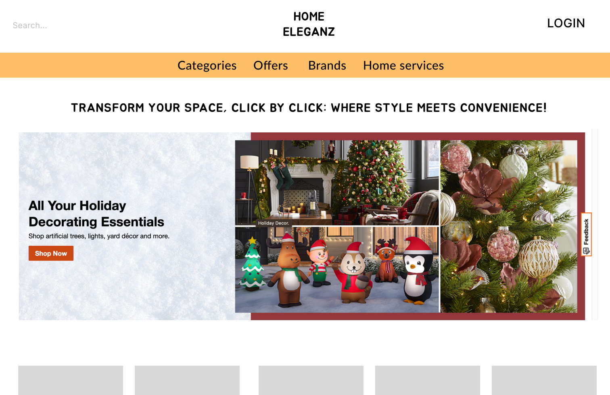
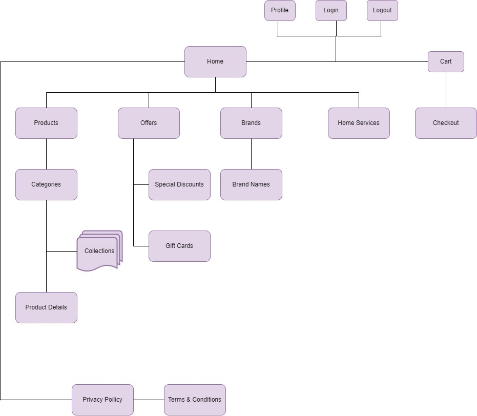
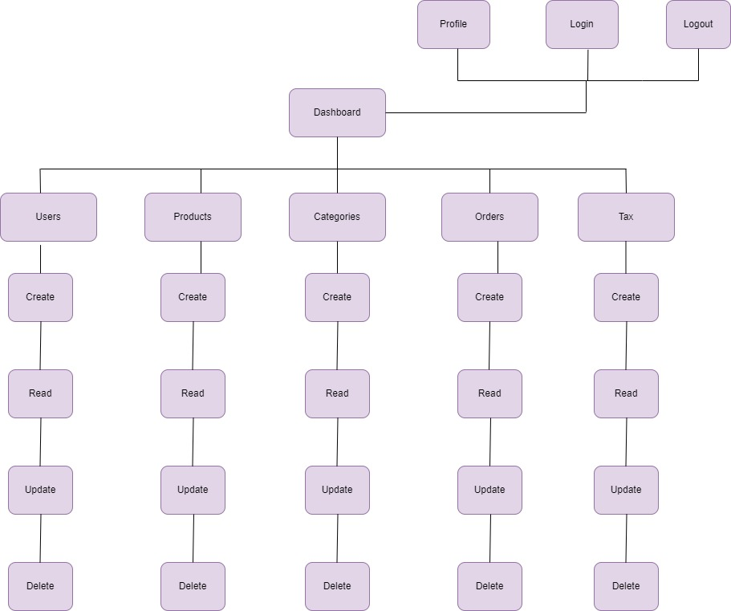
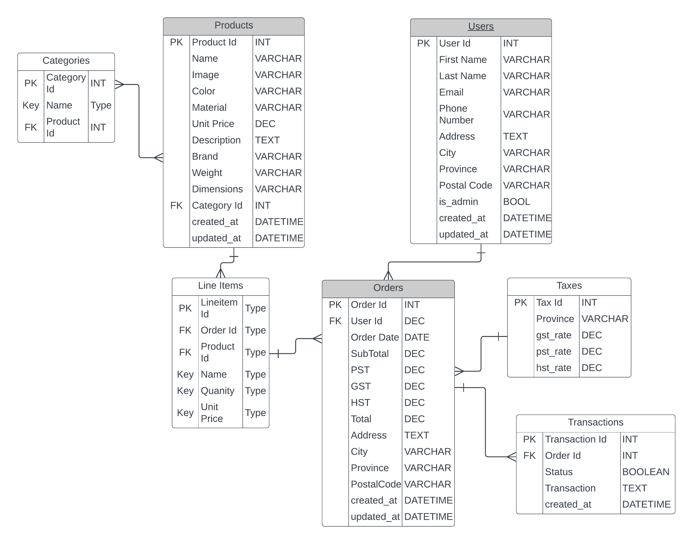

* Proposal Outline
* Home Eleganz
* From: Team 1 (Sahil, Shishir, Medha, Navraj, Arshdeep)
* To: Steve George
* Date: 06 December 2023

# 1. Project Description
 Home Eleganz is a website that typically serves as a comprehensive online platform for both homeowners and interior design enthusiasts. The website will be optimized for a smooth shopping experience, with a responsive design that works well on both desktop and mobile devices. Payment gateway integration is crucial, offering secure and diverse payment options.

# 2. Target audiences
- Homeowners looking to decorate or redecorate their spaces.
- Interior design enthusiasts and DIY decorators.
- Real estate professionals and property stagers.
- Commercial clients, including businesses and hospitality sectors.
- Eco-conscious consumers preferring sustainable and ethical decor.

# 3. Project Details
- Development of an e-commerce platform with an intuitive user interface.
- Integration of a comprehensive product catalog with detailed descriptions and high-quality images.
- Implementation of user accounts, user reviews, and online purchase of products.

# 4. Proposed Design Solution
- A clean, modern, and intuitive web design that highlights product visuals.
- Easy navigation with clear categorization of products.
- Responsive design ensuring compatibility with various devices and screen sizes.

## Home Page

## List View

## Product Details

# 5. Users
- Guest: Can browse products and read blog content without registration but cannot make purchases.
- User: Registered users can make purchases, track orders, save favorites, and access exclusive content.
- Admin: Can manage product listings, process orders, update website content, and access analytics.

# 6. Sitemaps

## a. Front End Sitemap

## a. Back End Sitemap

# 8. Server

# 9. Security
## On the Server:
- Robust Firewalls and Intrusion Detection Systems: To prevent unauthorized access and monitor potentially malicious activities.
- Data Encryption: Utilizing advanced encryption standards to protect data at rest and in transit.
- Regular Security Updates and Patches: Ensuring the server software is up-to-date to mitigate vulnerabilities.
- DDoS Protection: Implementing measures to safeguard against Distributed Denial-of-Service attacks.
- Access Control: Strict protocols for server access, with multi-factor authentication and role-based access control.
- Regular Backups: Maintaining frequent backups of the server data to prevent data loss in case of an incident.

## In the Web App:
- Secure Socket Layer (SSL) Certification: Encrypting data exchanged between the user and the server to prevent data interception.
- Secure Coding Practices: Adhering to best practices in coding to avoid common web security pitfalls like SQL injection, cross-site scripting (XSS), and cross-site request forgery (CSRF).
- User Authentication and Authorization: Implementing strong password policies and session management for user accounts.
- Data Validation: Ensuring all user input is validated both on the client and server side to prevent malicious data processing.
- API Security: Securing application programming interfaces (APIs) with tokens or other secure methods of authentication.
- Regular Security Audits: Conducting periodic reviews and audits of the web application to identify and rectify potential security issues.

# 10. Database

The database is planned to consist of the following tables:
1. Products
    * Product Id - PK
    * Name
    * Summary
    * Price
    * Description
    * Quantity
    * Weight
    * Dimensions
    * Category Id - FK
2. Categories
    * Category Id - PK
    * Name
    * Product Id - FK
3. Customers
    * Customer Id - PK
    * First Name
    * Last Name
    * email
    * Password
    * Address
    * City
    * Province
    * Postal Code
    * phone number
4. Orders
    * Order Id - PK
    * Date 
    * Sub Total
    * PST
    * GST
    * HST
    * Total
    * Address
    * City
    * Province
    * Postal Code
    * Customer id - FK
5. Line Items
    * Line items id
    * Order Id - FK
    * Product Id
    * Quantity
    * Unit price
    * Subtotal
6. Taxes
    * Tax ID
    * PST rate
    * GST rate
    * HST rate
    * VAT rate
    * Province
8. Transactions
    * Transaction Id
    * Order Id
    * Status
    * Transaction
Added value: 9. Reviews
* Review Id (PK)
* Product Id (FK)
* Customer Id (FK)
* Comment
  

# 11. Value Adds
- Email functionality.
- Comment section.

# 12. Revised ERD for Value Adds

# 13. Our Team
We are a skilled team of web developers, designers, content creators, and marketing professionals.Each member brings expertise in their respective fields to ensure the success of the project. Our team members are:
- Sahil (PM/Git)
- Shishir
- Medha
- Arshdeep
- Navraj

